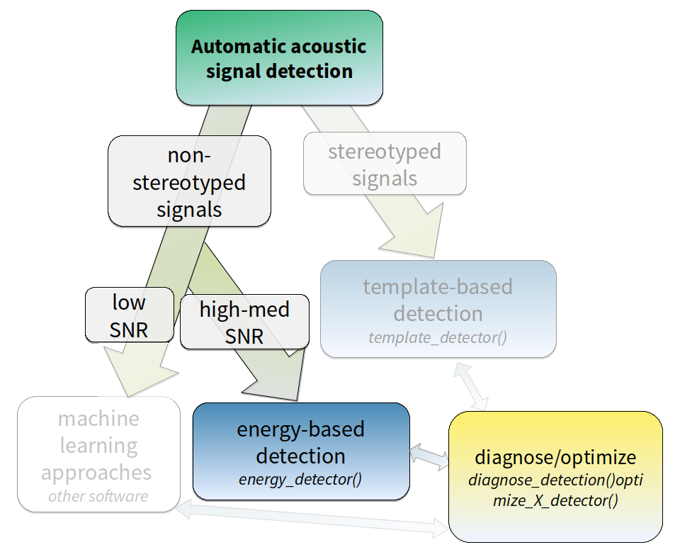
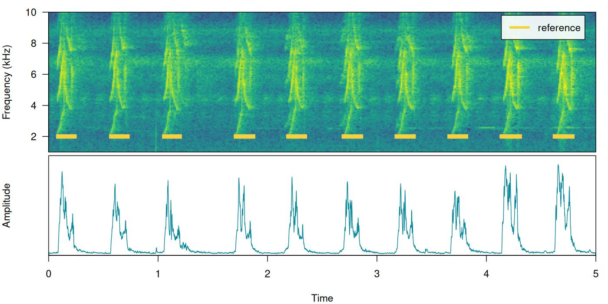
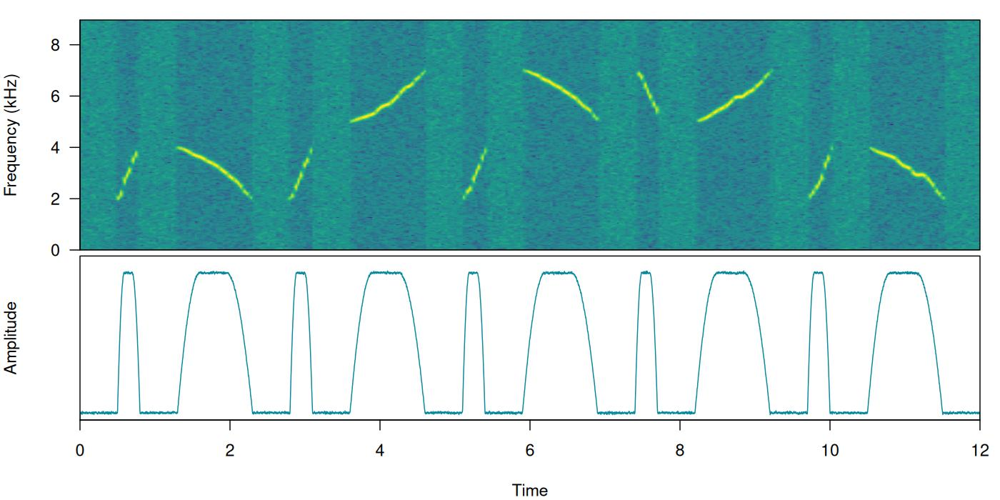
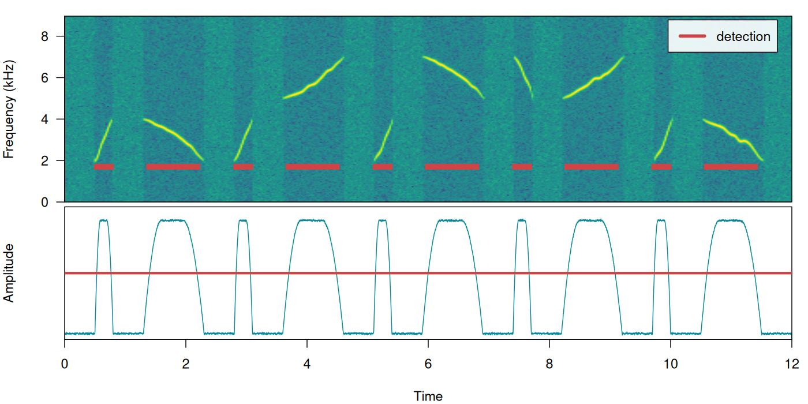
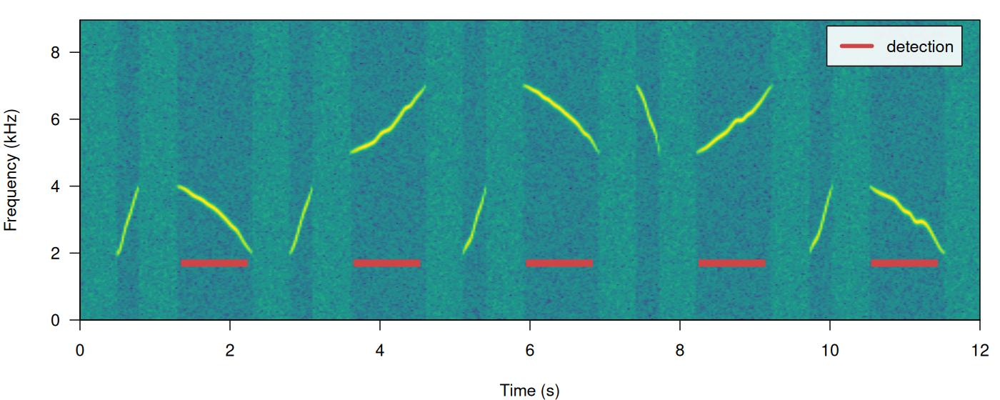
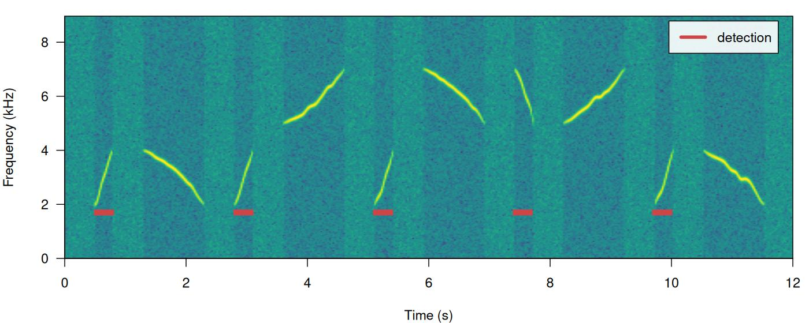
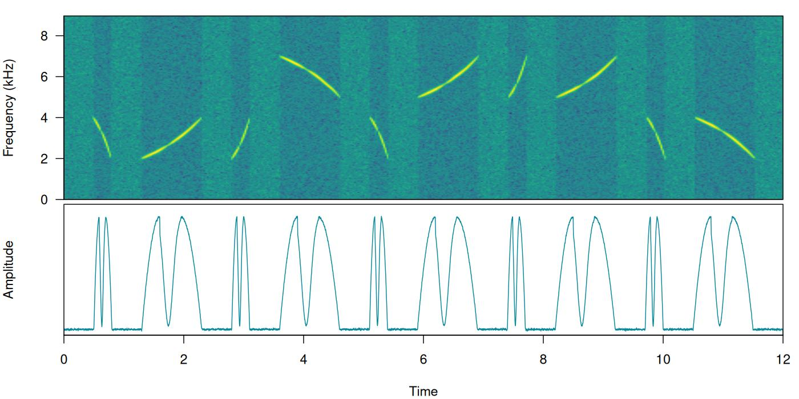

# Energy-based detection

This vignette details the use of energy-based detection in
[ohun](https://docs.ropensci.org/ohun/). The energy detector approach
uses amplitude envelopes to infer the position of sound events.
Amplitude envelopes are representations of the variation in energy
through time. This type of detector doesn’t require highly stereotyped
sound events, although they work better on high quality recordings in
which the amplitude of target sound events is higher than the background
noise (i.e. high signal-to-noise ratio):



*Diagram depicting how target sound event features can be used to tell
the most adequate sound event detection approach. Steps in which ‘ohun’
can be helpful are shown in color. (SNR = signal-to-noise ratio)*

First, we need to install the package. It can be installed from CRAN as
follows:

``` r

# From CRAN would be
install.packages("ohun")

#load package
library(ohun)
```

To install the latest developmental version from
[github](https://github.com/) you will need the R package
[remotes](https://cran.r-project.org/package=devtools):

``` r

# install package
remotes::install_github("maRce10/ohun")

#load packages
library(ohun)
library(tuneR)
library(warbleR)
```

The package comes with an example reference table containing annotations
of long-billed hermit hummingbird songs from two sound files (also
supplied as example data: ‘lbh1’ and ‘lbh2’), which will be used in this
vignette. The example data can be load and explored as follows:

``` r

# load example data
data("lbh1", "lbh2", "lbh_reference")

# save sound files
tuneR::writeWave(lbh1, file.path(tempdir(), "lbh1.wav"))
tuneR::writeWave(lbh2, file.path(tempdir(), "lbh2.wav"))

# select a subset of the data
lbh1_reference <-
  lbh_reference[lbh_reference$sound.files == "lbh1.wav",]

# print data
lbh1_reference
```

    
[30mObject of class 
[1m'selection_table'
[22m
[39m

    
[90m* The output of the following call:
[39m

    
[90m
[3m`[.selection_table`(X = lbh_reference, i = lbh_reference$sound.files == 
[23m
[39m
[90m
[3m"lbh1.wav")
[23m
[39m

    
[90m
[1m
    Contains:
[22m 
    *  A selection table data frame with 10 rows and 6 columns:
[39m

    
[90m     sound.files    selec    start      end   bottom.freq   top.freq
[39m

    
[90m---  ------------  ------  -------  -------  ------------  ---------
[39m

    
[90m10   lbh1.wav          10   0.0881   0.2360        1.9824     8.4861
[39m

    
[90m11   lbh1.wav          11   0.5723   0.7202        2.0520     9.5295
[39m

    
[90m12   lbh1.wav          12   1.0564   1.1973        2.0868     8.4861
[39m

    
[90m13   lbh1.wav          13   1.7113   1.8680        1.9824     8.5905
[39m

    
[90m14   lbh1.wav          14   2.1902   2.3417        2.0520     8.5209
[39m

    
[90m15   lbh1.wav          15   2.6971   2.8538        1.9824     9.2513
[39m

    
[90m... and 4 more row(s)
[39m

    
[90m
    * A data frame (check.results) with 10 rows generated by check_sels() (as an attribute)
[39m

    
[90mcreated by warbleR < 1.1.21
[39m

We can plot the annotations on top of the spectrogram and amplitude
envelope to further explore the data (this function only plots one wave
object at the time, not really useful for long files):

``` r

# print spectrogram
label_spectro(wave = lbh1, reference = lbh1_reference, hop.size = 10, ovlp = 50, flim = c(1, 10), envelope = TRUE)
```



## How it works

The function `ernergy_detector()` performs this type of detection. We
can understand how to use `ernergy_detector()` using simulated sound
events. We will do that using the function
[`simulate_songs()`](https://marce10.github.io/warbleR/reference/simulate_songs.html)
from [warbleR](https://CRAN.R-project.org/package=warbleR). In this
example we simulate a recording with 10 sounds with two different
frequency ranges and durations:

``` r

# install this package first if not installed
# install.packages("Sim.DiffProc")

#Creating vector for duration 
durs <- rep(c(0.3, 1), 5)

set.seed(123)
freqs <- sample(c(3, 6), 10, replace = TRUE)

#Creating simulated song
set.seed(12)
simulated_1 <-
  warbleR::simulate_songs(
    n = 10,
    durs = durs,
    freqs = freqs,
    sig2 = 0.1,
    gaps = 0.5,
    harms = 1,
    bgn = 0.1,
    freq.range = 2,
    path = tempdir(),
    file.name = "simulated_1",
    selec.table = TRUE,
    shape = "cos",
    fin = 0.3,
    fout = 0.35,
    samp.rate = 18
  )$wave
```

The function call saves a ‘.wav’ sound file in a temporary directory
([`tempdir()`](https://rdrr.io/r/base/tempfile.html)) and also returns a
`wave` object in the R environment. This outputs will be used to run
energy-based detection and creating plots, respectively. This is how the
spectrogram and amplitude envelope of the simulated recording look like:

``` r

# plot spectrogram and envelope
label_spectro(wave = simulated_1,
              env = TRUE,
              fastdisp = TRUE)
```



Note that the amplitude envelope shows a high signal-to-noise ratio of
the sound events, which is ideal for energy-based detection. This can be
conducted using `ernergy_detector()` as follows:

``` r

# run detection
detection <-
  energy_detector(
    files = "simulated_1.wav",
    bp = c(2, 8),
    threshold = 50,
    smooth = 150,
    path = tempdir()
  )
```

    
[30mdetecting sound events (step 0 of 0):
[39m

``` r

# plot spectrogram and envelope
label_spectro(
  wave = simulated_1,
  envelope = TRUE,
  detection = detection,
  threshold = 50
)
```



The output is a selection table:

``` r

detection
```

    
[30mObject of class 
[1m'selection_table'
[22m
[39m

    
[90m* The output of the following call:
[39m

    
[90m
[3menergy_detector(files = "simulated_1.wav", path = tempdir(), 
[23m
[39m
[90m
[3mbp = c(2, 8), smooth = 150, threshold = 50)
[23m
[39m

    
[90m
[1m
    Contains:
[22m 
    *  A selection table data frame with 10 rows and 5 columns:
[39m

    
[90msound.files        duration   selec    start      end
[39m

    
[90m----------------  ---------  ------  -------  -------
[39m

    
[90msimulated_1.wav      0.2325       1   0.5314   0.7639
[39m

    
[90msimulated_1.wav      0.7943       2   1.3955   2.1898
[39m

    
[90msimulated_1.wav      0.2332       3   2.8308   3.0640
[39m

    
[90msimulated_1.wav      0.7942       4   3.6957   4.4899
[39m

    
[90msimulated_1.wav      0.2330       5   5.1310   5.3640
[39m

    
[90msimulated_1.wav      0.7942       6   5.9957   6.7899
[39m

    
[90m... and 4 more row(s)
[39m

    
[90m
    * A data frame (check.results) with 10 rows generated by check_sels() (as an attribute)
[39m

    
[90mcreated by warbleR 1.1.37
[39m

Now we will make use of some additional arguments to filter out specific
sound events based on their structural features. For instance we can use
the argument `minimum.duration` to provide a time treshold (in ms) to
exclude short sound events and keep only the longest sound events:

``` r

# run detection
detection <-
  energy_detector(
    files = "simulated_1.wav",
    bp = c(1, 8),
    threshold = 50,
    min.duration = 500,
    smooth = 150,
    path = tempdir()
  )

# plot spectrogram
label_spectro(wave = simulated_1, detection = detection)
```



We can use the argument `max.duration` (also in ms) to exclude long
sound events and keep the short ones:

``` r

# run detection
detection <- energy_detector(files = "simulated_1.wav", bp = c(1, 8),  threshold = 50, smooth = 150, max.duration = 500, path = tempdir())

# plot spectrogram
label_spectro(wave = simulated_1,  detection = detection)
```



We can also focus the detection on specific frequency ranges using the
argument `bp` (bandpass). By setting `bp = c(5, 8)` only those sound
events found within that frequency range (5-8 kHz) will be detected,
which excludes sound events below 5 kHz:

``` r

# Detecting 
detection <- energy_detector(files = "simulated_1.wav", bp = c(5, 8), threshold = 50, smooth = 150, path = tempdir())

# plot spectrogram
label_spectro(wave = simulated_1,  detection = detection)
```


The same logic can be applied to detect those sound events found below 5
kHz. We just need to set the upper bound of the band pass filter below
the range of the higher frequency sound events (for instance
`bp = (0, 5)`):

``` r

# Detect
detection <-
  energy_detector(
    files = "simulated_1.wav",
    bp = c(0, 5),
    threshold = 50,
    min.duration = 1,
    smooth = 150,
    path = tempdir()
  )

# plot spectrogram
label_spectro(wave = simulated_1,  detection = detection)
```


Amplitude modulation (variation in amplitude across a sound event) can
be problematic for detection based on amplitude envelopes. We can also
simulate some amplitude modulation using
[`warbleR::simulate_songs()`](https://marce10.github.io/warbleR/reference/simulate_songs.html):

``` r

#Creating simulated song
set.seed(12)

#Creating vector for duration
durs <- rep(c(0.3, 1), 5)

# and a frequency vector
set.seed(123)
freqs <- sample(c(3, 6), 10, replace = TRUE)


sim_2 <-
  simulate_songs(
    n = 10,
    durs = durs,
    freqs = freqs,
    sig2 = 0.01,
    gaps = 0.5,
    harms = 1,
    bgn = 0.1,
    freq.range = 2,    
    path = tempdir(),
    file.name = "simulated_2",
    selec.table = TRUE,
    shape = "cos",
    fin = 0.3,
    fout = 0.35,
    samp.rate = 18,
    am.amps = c(1, 2, 3, 2, 0.1, 2, 3, 3, 2, 1)
  )

# extract wave object and selection table
simulated_2 <- sim_2$wave
sim2_sel_table <- sim_2$selec.table

# plot spectrogram
label_spectro(wave = simulated_2, envelope = TRUE)
```



When sound events have strong amplitude modulation they can be split
during detection:

``` r

# detect sounds
detection <- energy_detector(files = "simulated_2.wav", threshold = 50, path = tempdir())

# plot spectrogram
label_spectro(wave = simulated_2, envelope = TRUE, threshold = 50, detection = detection)
```


There are two arguments that can deal with this: `holdtime` and
`smooth`. `hold.time` allows to merge split sound events that are found
within a given time range (in ms). This time range should be high enough
to merge things belonging to the same sound event but not too high so it
merges different sound events. For this example a `hold.time` of 200 ms
can do the trick (we know gaps between sound events are ~0.5 s long):

``` r

# detect sounds
detection <-
  energy_detector(
    files = "simulated_2.wav",
    threshold = 50,
    min.duration = 1,
    path = tempdir(),
    hold.time = 200
  )

# plot spectrogram
label_spectro(
  wave = simulated_2,
  envelope = TRUE,
  threshold = 50,
  detection = detection
)
```


`smooth` works by merging the amplitude envelope ‘hills’ of the split
sound events themselves. It smooths envelopes by applying a sliding
window averaging of amplitude values. It’s given in ms of the window
size. A `smooth` of 350 ms can merged back split sound events from our
example:

``` r

# detect sounds
detection <-
  energy_detector(
    files = "simulated_2.wav",
    threshold = 50,
    min.duration = 1,
    path = tempdir(),
    smooth = 350
  )

# plot spectrogram
label_spectro(
  wave = simulated_2,
  envelope = TRUE,
  threshold = 50,
  detection = detection,
  smooth = 350
)
```


The function has some additional arguments for further filtering
detections (`peak.amplitude`) and speeding up analysis (`thinning` and
`parallel`).

## Optimizing energy-based detection

This last example using `smooth` can be used to showcase how the tunning
parameters can be optimized. As explained above, to do this we need a
reference table that contains the time position of the target sound
events. The function
[`optimize_energy_detector()`](https://docs.ropensci.org/ohun/reference/optimize_energy_detector.md)
can be used finding the optimal parameter values. We must provide the
range of parameter values that will be evaluated:

``` r

optim_detection <-
  optimize_energy_detector(
    reference = sim2_sel_table,
    files = "simulated_2.wav",
    threshold = 50,
    min.duration = 1,
    path = tempdir(),
    smooth = c(100, 250, 350)
  )
```

    3 combinations will be evaluated:

``` r

optim_detection[, c(1, 2:5, 7:12, 17:18)]
```

      threshold peak.amplitude smooth hold.time min.duration thinning detections
    1        50              0    100         0            1        1         20
    2        50              0    250         0            1        1         15
    3        50              0    350         0            1        1         10
      true.positives false.positives false.negatives splits   overlap
    1              0              20              10      0        NA
    2              5              10               5      0 0.5023727
    3             10               0               0      0 0.7224533
      proportional.duration.true.positives
    1                                   NA
    2                            0.5023727
    3                            0.7843797

The output contains the combination of parameters used at each iteration
as well as the corresponding diagnose indices. In this case all
combinations generate a good detection (recall & precision = 1).
However, only the routine with the highest `smooth` (last row) has no
split sound events (‘split.positive’ column). It also shows a better
overlap to the reference sound events (‘overlap’ closer to 1).

In addition, there are two complementary functions for optimizing
energy-based detection routines:
[`summarize_reference()`](https://docs.ropensci.org/ohun/reference/summarize_reference.md)
and
[`merge_overlaps()`](https://docs.ropensci.org/ohun/reference/merge_overlaps.md).
[`summarize_reference()`](https://docs.ropensci.org/ohun/reference/summarize_reference.md)
allow user to get a sense of the time and frequency characteristics of a
reference table. This information can be used to determine the range of
tuning parameter values during optimization. This is the output of the
function applied to `lbh_reference`:

``` r

summarize_reference(reference = lbh_reference, path = tempdir())
```

                      min   mean    max
    sel.duration   117.96 142.60 163.73
    gap.duration   322.16 396.43 514.08
    annotations      9.00   9.50  10.00
    duty.cycle       0.24   0.27   0.31
    peak.amplitude  73.76  81.58  88.03
    bottom.freq      1.81   2.11   2.37
    top.freq         8.49   8.82   9.53

Features related to selection duration can be used to set the
‘max.duration’ and ‘min.duration’ values, frequency related features can
inform banpass values, gap related features inform hold time values and
duty cycle can be used to evaluate performance. Peak amplitude can be
used to keep only those sound events with the highest intensity, mostly
useful for routines in which only a subset of the target sound events
present in the recordings is needed.

[`merge_overlaps()`](https://docs.ropensci.org/ohun/reference/merge_overlaps.md)
finds time-overlapping selections in reference tables and collapses them
into a single selection. Overlapping selections would more likely appear
as a single amplitude ‘hill’ and thus would be detected as a single
sound event. So
[`merge_overlaps()`](https://docs.ropensci.org/ohun/reference/merge_overlaps.md)
can be useful to prepare references in a format representing a more
realistic expectation of how a pefect energy detection routine would
look like.

------------------------------------------------------------------------

Please cite [ohun](https://docs.ropensci.org/ohun/) like this:

Araya-Salas, M. (2021), *ohun: diagnosing and optimizing automated sound
event detection*. R package version 0.1.0.

## References

1.  Araya-Salas, M., Smith-Vidaurre, G., Chaverri, G., Brenes, J. C.,
    Chirino, F., Elizondo-Calvo, J., & Rico-Guevara, A. (2023). ohun: An
    R package for diagnosing and optimizing automatic sound event
    detection. Methods in Ecology and Evolution, 14, 2259–2271.
    <https://doi.org/10.1111/2041-210X.14170>
2.  Araya-Salas M, Smith-Vidaurre G (2017) warbleR: An R package to
    streamline analysis of animal acoustic signals. Methods in Ecology
    and Evolution, 8:184-191.
3.  Knight, E.C., Hannah, K.C., Foley, G.J., Scott, C.D., Brigham, R.M.
    & Bayne, E. (2017). Recommendations for acoustic recognizer
    performance assessment with application to five common automated
    signal recognition programs. Avian Conservation and Ecology,
4.  Macmillan, N. A., & Creelman, C.D. (2004). Detection theory: A
    user’s guide. Psychology press.

------------------------------------------------------------------------

Session information

    R version 4.6.0 (2026-04-24)
    Platform: x86_64-pc-linux-gnu
    Running under: Ubuntu 24.04.4 LTS

    Matrix products: default
    BLAS:   /usr/lib/x86_64-linux-gnu/openblas-pthread/libblas.so.3 
    LAPACK: /usr/lib/x86_64-linux-gnu/openblas-pthread/libopenblasp-r0.3.26.so;  LAPACK version 3.12.0

    locale:
     [1] LC_CTYPE=en_US.UTF-8       LC_NUMERIC=C               LC_TIME=en_US.UTF-8       
     [4] LC_COLLATE=en_US.UTF-8     LC_MONETARY=en_US.UTF-8    LC_MESSAGES=en_US.UTF-8   
     [7] LC_PAPER=en_US.UTF-8       LC_NAME=C                  LC_ADDRESS=C              
    [10] LC_TELEPHONE=C             LC_MEASUREMENT=en_US.UTF-8 LC_IDENTIFICATION=C       

    time zone: Etc/UTC
    tzcode source: system (glibc)

    attached base packages:
    [1] stats     graphics  grDevices utils     datasets  methods   base     

    other attached packages:
    [1] warbleR_1.1.37     NatureSounds_1.0.5 knitr_1.51         seewave_2.2.4     
    [5] tuneR_1.4.7        ohun_1.0.4        

    loaded via a namespace (and not attached):
     [1] gtable_0.3.6       rjson_0.2.23       xfun_0.60          bslib_0.12.0      
     [5] ggplot2_4.0.3      vctrs_0.7.3        tools_4.6.0        bitops_1.1-0      
     [9] curl_8.0.0         parallel_4.6.0     proxy_0.4-29       pkgconfig_2.0.3   
    [13] KernSmooth_2.23-26 checkmate_2.3.4    RColorBrewer_1.1-3 S7_0.2.2          
    [17] desc_1.4.3         lifecycle_1.0.5    compiler_4.6.0     farver_2.1.2      
    [21] textshaping_1.0.5  brio_1.1.5         htmltools_0.5.9    class_7.3-23      
    [25] sass_0.4.10        RCurl_1.98-1.20    yaml_2.3.12        pkgdown_2.2.1     
    [29] jquerylib_0.1.4    MASS_7.3-65        classInt_0.4-11    cachem_1.1.0      
    [33] viridis_0.6.5      Deriv_4.3.0        digest_0.6.39      sf_1.1-2          
    [37] fastmap_1.2.0      grid_4.6.0         cli_3.6.6          magrittr_2.0.5    
    [41] e1071_1.7-17       scales_1.4.0       backports_1.5.1    rmarkdown_2.31    
    [45] httr_1.4.8         Sim.DiffProc_5.0   signal_1.8-1       igraph_2.3.3      
    [49] otel_0.2.0         gridExtra_2.3.1    ragg_1.5.2         pbapply_1.7-4     
    [53] evaluate_1.0.5     dtw_1.23-3         fftw_1.0-9         testthat_3.3.2    
    [57] viridisLite_0.4.3  rlang_1.3.0        Rcpp_1.1.2         glue_1.8.1        
    [61] DBI_1.3.0          jsonlite_2.0.0     R6_2.6.1           systemfonts_1.3.2 
    [65] fs_2.1.0           units_1.0-1       
