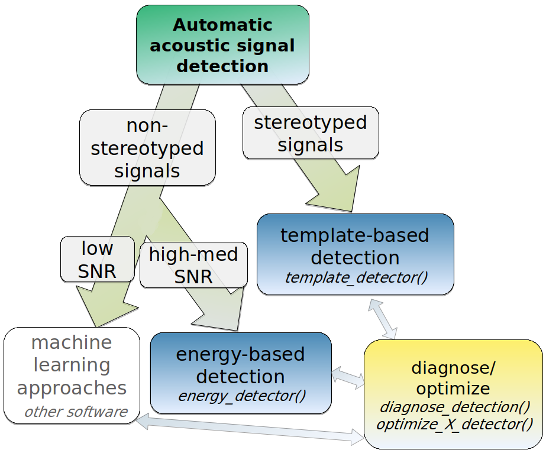
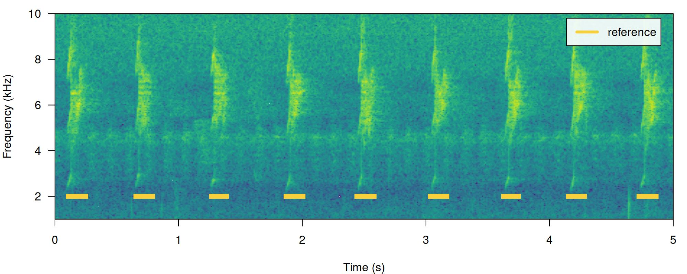
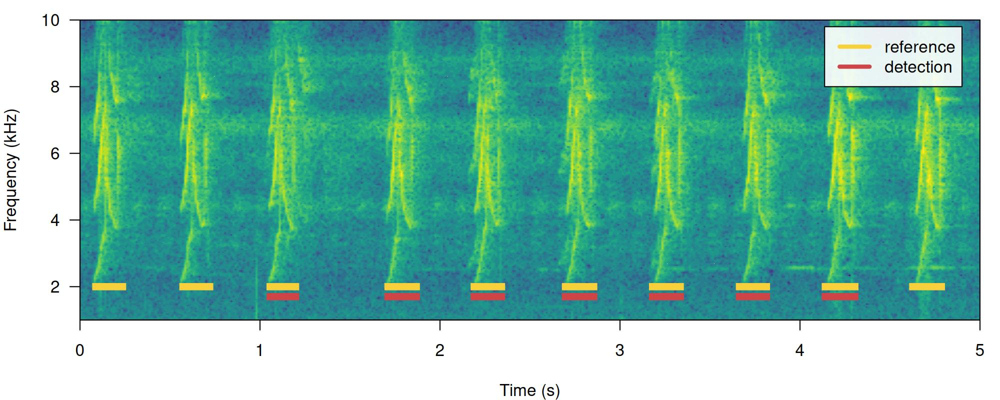
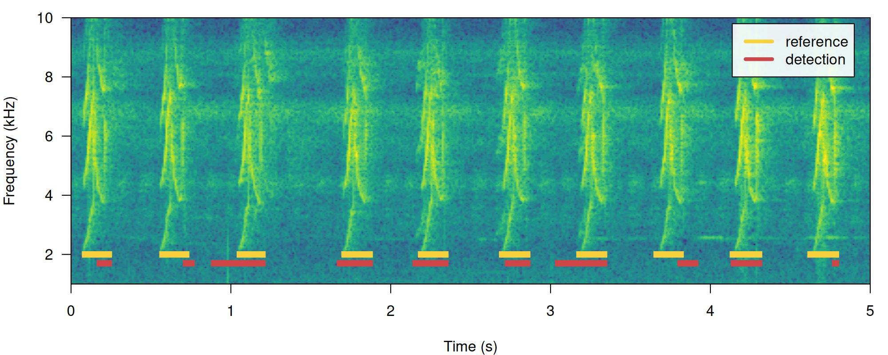
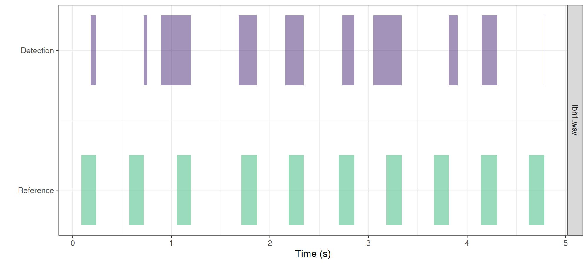
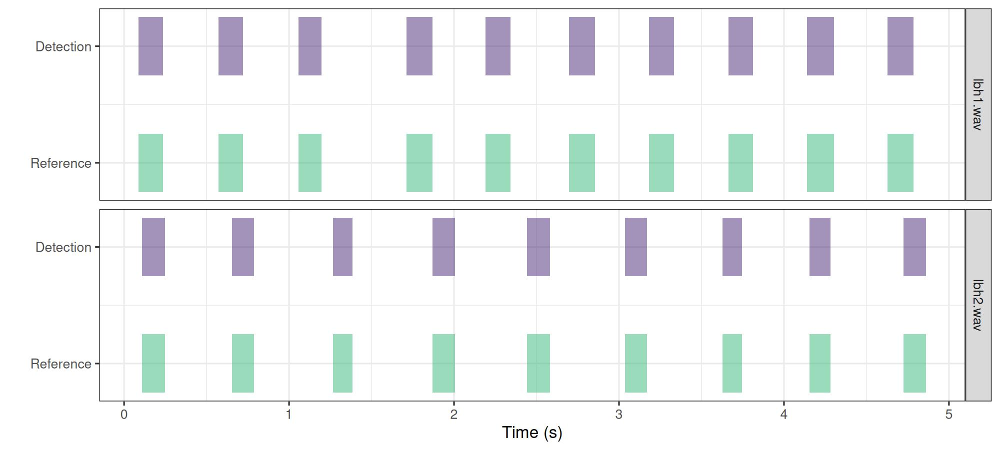

# Optimizing sound event detection

  

[ohun](https://github.com/ropensci/ohun) is intended to facilitate the
automated detection of sound events, providing functions to diagnose and
optimize detection routines. Detections from other software can also be
explored and optimized. This vignette provides a general overview of
sound event optimization in [ohun](https://github.com/ropensci/ohun) as
well as basic concepts from signal detection theory.

The main features of the package are:

- The use of reference annotations for detection optimization and
  diagnostic
- The use of signal detection theory indices to evaluate detection
  performance

The package offers functions for:

- Curate references and acoustic data sets
- Diagnose detection performance
- Optimize detection routines based on reference annotations
- Energy-based detection
- Template-based detection

All functions allow the parallelization of tasks, which distributes the
tasks among several processors to improve computational efficiency. The
package works on sound files in ‘.wav’, ‘.mp3’, ‘.flac’ and ‘.wac’
format.

------------------------------------------------------------------------

The package can be installed from CRAN as follows:

``` r

# From CRAN would be
install.packages("ohun")

#load package
library(ohun)
```

To install the latest developmental version from
[github](https://github.com/) you will need the R package
[remotes](https://cran.r-project.org/package=devtools):

``` r

# install package
remotes::install_github("maRce10/ohun")

#load packages
library(ohun)
library(tuneR)
library(warbleR)
```

------------------------------------------------------------------------

## Automatic sound event detection

Finding the position of sound events in a sound file is a challenging
task. [ohun](https://github.com/ropensci/ohun) offers two methods for
automated sound event detection: template-based and energy-based
detection. These methods are better suited for highly stereotyped or
good signal-to-noise ratio (SNR) sounds, respectively. If the target
sound events don’t fit these requirements, more elaborated methods
(i.e. machine learning approaches) are warranted:



*Diagram depicting how target sound event features can be used to tell
the most adequate sound event detection approach. Steps in which ‘ohun’
can be helpful are shown in color. (SNR = signal-to-noise ratio)*

Also note that the presence of other sounds overlapping the target sound
events in time and frequency can strongly affect detection performance
for the two methods in [ohun](https://github.com/ropensci/ohun).

Still, a detection run using other software can be optimized with the
tools provided in [ohun](https://github.com/ropensci/ohun).

## Signal detection theory applied to bioacoustics

Broadly speaking, signal detection theory deals with the process of
recovering signals (i.e. target signals) from background noise (not
necessarily acoustic noise) and it’s widely used for optimizing this
decision making process in the presence of uncertainty. During a
detection routine, the detected ‘items’ can be classified into 4
classes:

- **True positives (TPs)**: signals correctly identified as ‘signal’
- **False positives (FPs)**: background noise incorrectly identified as
  ‘signal’
- **False negatives (FNs)**: signals incorrectly identified as
  ‘background noise’
- **True negatives (TNs)**: background noise correctly identified as
  ‘background noise’

Several additional indices derived from these indices are used to
evaluate the performance of a detection routine. These are three useful
indices in the context of sound event detection included in
[ohun](https://github.com/ropensci/ohun):

- **Recall**: correct detections relative to total references (a.k.a.
  true positive rate or sensitivity; *TPs / (TPs + FNs)*)
- **Precision**: correct detections relative to total detections (*TPs /
  (TPs + FPs)*).
- **F score**: combines recall and precision as the harmonic mean of
  these two, so it provides a single value for evaluating performance
  (a.k.a. F-measure or Dice similarity coefficient).

*(Metrics that make use of ‘true negatives’ cannot be easily applied in
the context of sound event detection as noise cannot always be
partitioned in discrete units)*

A perfect detection will have no false positives or false negatives,
which will result in both recall and precision equal to 1. However,
perfect detection cannot always be reached and some compromise between
detecting all target signals plus some noise (recall = 1 & precision
\< 1) and detecting only target signals but not all of them (recall \< 1
& precision = 1) is warranted. The right balance between these two
extremes will be given by the relative costs of missing signals and
mistaking noise for signals. Hence, these indices provide an useful
framework for diagnosing and optimizing the performance of a detection
routine.

The package [ohun](https://github.com/ropensci/ohun) provides a set of
tools to evaluate the performance of an sound event detection based on
the indices described above. To accomplish this, the result of a
detection routine is compared against a reference table containing the
time position of all target sound events in the sound files. The package
comes with an example reference table containing annotations of
long-billed hermit hummingbird songs from two sound files (also supplied
as example data: ‘lbh1’ and ‘lbh2’), which can be used to illustrate
detection performance evaluation. The example data can be explored as
follows:

``` r

# load example data
data("lbh1", "lbh2", "lbh_reference")

lbh_reference
```

    
[30mObject of class 
[1m'selection_table'
[22m
[39m

    
[90m* The output of the following call:
[39m

    
[90m
[3mwarbleR::selection_table(X = lbh_reference)
[23m
[39m

    
[90m
[1m
    Contains:
[22m 
    *  A selection table data frame with 19 rows and 6 columns:
[39m

    
[90msound.files    selec    start      end   bottom.freq   top.freq
[39m

    
[90m------------  ------  -------  -------  ------------  ---------
[39m

    
[90mlbh2.wav           1   0.1092   0.2482        2.2954     8.9382
[39m

    
[90mlbh2.wav           2   0.6549   0.7887        2.2954     9.0426
[39m

    
[90mlbh2.wav           3   1.2658   1.3856        2.2606     9.0774
[39m

    
[90mlbh2.wav           4   1.8697   2.0053        2.1911     8.9035
[39m

    
[90mlbh2.wav           5   2.4418   2.5809        2.1563     8.6600
[39m

    
[90mlbh2.wav           6   3.0368   3.1689        2.2259     8.9382
[39m

    
[90m... and 13 more row(s)
[39m

    
[90m
    * A data frame (check.results) with 19 rows generated by check_sels() (as an attribute)
[39m

    
[90mcreated by warbleR 1.1.27
[39m

This is a ‘selection table’, an object class provided by the package
[warbleR](https://CRAN.R-project.org/package=warbleR) (see
[`selection_table()`](https://marce10.github.io/warbleR/reference/selection_table.html)
for details). Selection tables are basically data frames in which the
contained information has been double-checked (using warbleR’s
[`check_sels()`](https://marce10.github.io/warbleR/reference/check_sels.html)).
But they behave pretty much as data frames and can be easily converted
to data frames:

``` r

# convert to data frame
as.data.frame(lbh_reference)
```

       sound.files selec    start       end bottom.freq top.freq
    1     lbh2.wav     1 0.109161 0.2482449      2.2954   8.9382
    2     lbh2.wav     2 0.654921 0.7887232      2.2954   9.0426
    3     lbh2.wav     3 1.265850 1.3855678      2.2606   9.0774
    4     lbh2.wav     4 1.869705 2.0052678      2.1911   8.9035
    5     lbh2.wav     5 2.441769 2.5808529      2.1563   8.6600
    6     lbh2.wav     6 3.036825 3.1688667      2.2259   8.9382
    7     lbh2.wav     7 3.628617 3.7465742      2.3302   8.6252
    8     lbh2.wav     8 4.153288 4.2818085      2.2954   8.4861
    9     lbh2.wav     9 4.723673 4.8609963      2.3650   8.6948
    10    lbh1.wav    10 0.088118 0.2360047      1.9824   8.4861
    11    lbh1.wav    11 0.572290 0.7201767      2.0520   9.5295
    12    lbh1.wav    12 1.056417 1.1972614      2.0868   8.4861
    13    lbh1.wav    13 1.711338 1.8680274      1.9824   8.5905
    14    lbh1.wav    14 2.190249 2.3416568      2.0520   8.5209
    15    lbh1.wav    15 2.697143 2.8538324      1.9824   9.2513
    16    lbh1.wav    16 3.181315 3.3344833      1.9129   8.4861
    17    lbh1.wav    17 3.663719 3.8133662      1.8781   8.6948
    18    lbh1.wav    18 4.140816 4.3045477      1.8433   9.2165
    19    lbh1.wav    19 4.626712 4.7851620      1.8085   8.9035

All [ohun](https://github.com/ropensci/ohun) functions that work with
this kind of data can take both selection tables and data frames.
Spectrograms with highlighted sound events from a selection table can be
plotted with the function
[`label_spectro()`](https://docs.ropensci.org/ohun/reference/label_spectro.md)
(this function only plots one wave object at the time, not really useful
for long files):

``` r

# save sound file
tuneR::writeWave(lbh1, file.path(tempdir(), "lbh1.wav"))

# save sound file
tuneR::writeWave(lbh2, file.path(tempdir(), "lbh2.wav"))

# print spectrogram
label_spectro(wave = lbh1, reference = lbh_reference[lbh_reference$sound.files == "lbh1.wav", ], hop.size = 10, ovlp = 50, flim = c(1, 10))
```


``` r

# print spectrogram
label_spectro(wave = lbh2, reference = lbh_reference[lbh_reference$sound.files == "lbh2.wav", ], hop.size = 10, ovlp = 50, flim = c(1, 10))
```



The function
[`diagnose_detection()`](https://docs.ropensci.org/ohun/reference/diagnose_detection.md)
evaluates the performance of a detection routine by comparing it to a
reference table. For instance, a perfect detection is given by comparing
`lbh_reference` to itself:

``` r

lbh1_reference <-
  lbh_reference[lbh_reference$sound.files == "lbh1.wav",]

# diagnose
diagnose_detection(reference = lbh1_reference, detection = lbh1_reference)[, c(1:3, 7:9)]
```

    
[30mlabeling detections (step 0 of 0):
[39m

      detections true.positives false.positives overlap recall precision
    1         10             10               0       1      1         1

We will work mostly with a single sound file for convenience but the
functions can work on several sound files at the time. The files should
be found in a single working directory. Although the above example is a
bit silly, it shows the basic diagnostic indices, which include basic
detection theory indices (‘true.positives’, ‘false.positives’,
‘false.negatives’, ‘recall’ and ‘precision’) mentioned above. We can
play around with the reference table to see how these indices can be
used to spot imperfect detection routines (and hopefully improve them!).
For instance, we can remove some sound events to see how this is
reflected in the diagnostics. Getting rid of some rows in ‘detection’,
simulating a detection with some false negatives, will affect the recall
but not the precision:

``` r

# create new table
lbh1_detection <- lbh1_reference[3:9,]

# print spectrogram
label_spectro(
  wave = lbh1,
  reference = lbh1_reference,
  detection = lbh1_detection,
  hop.size = 10,
  ovlp = 50,
  flim = c(1, 10)
)
```



``` r

# diagnose
diagnose_detection(reference = lbh1_reference, detection = lbh1_detection)[, c(1:3, 7:9)]
```

      detections true.positives false.positives overlap recall precision
    1          7              7               0       1    0.7         1

Having some additional sound events not in reference will do the
opposite, reducing precision but not recall. We can do this simply by
switching the tables:

``` r

# print spectrogram
label_spectro(
  wave = lbh1,
  detection = lbh1_reference,
  reference = lbh1_detection,
  hop.size = 10,
  ovlp = 50,
  flim = c(1, 10)
)
```


``` r

# diagnose
diagnose_detection(reference = lbh1_detection, detection = lbh1_reference)[, c(1:3, 7:9)]
```

      detections true.positives false.positives overlap recall precision
    1         10              7               3       1      1       0.7

The function offers three additional diagnose metrics:

- **Splits**: detections that share overlapping reference sounds with
  other detections  
- **Merges**: detections that overlap with two or more reference sounds
- **Proportional overlap of true positives**: ratio of the time overlap
  of true positives with its corresponding sound event in the reference
  table

In a perfect detection routine split and merged positives should be 0
while proportional overlap should be 1. We can shift the start of sound
events a bit to reflect a detection in which there is some mismatch to
the reference table regarding to the time location of sound events:

``` r

# create new table
lbh1_detection <- lbh1_reference

# add 'noise' to start
set.seed(18)
lbh1_detection$start <-
  lbh1_detection$start + rnorm(nrow(lbh1_detection), mean = 0, sd = 0.1)

## print spectrogram
label_spectro(
  wave = lbh1,
  reference = lbh1_reference,
  detection = lbh1_detection,
  hop.size = 10,
  ovlp = 50,
  flim = c(1, 10)
)
```



``` r

# diagnose
diagnose_detection(reference = lbh1_reference, detection = lbh1_detection)
```

      detections true.positives false.positives false.negatives splits merges   overlap
    1         10              5               5               5      0      0 0.7849767
      recall precision f.score
    1    0.5       0.5     0.5

In addition, the following diagnostics related to the duration of the
sound events can also be returned by setting `time.diagnostics = TRUE`.
Here we tweak the reference and detection data just to have some false
positives and false negatives:

``` r

# diagnose with time diagnostics
diagnose_detection(reference = lbh1_reference[-1, ], detection = lbh1_detection[-10, ], time.diagnostics = TRUE)
```

      detections true.positives false.positives false.negatives splits merges
    1          9              5               4               4      0      0
      mean.duration.true.positives mean.duration.false.positives
    1                          187                            58
      mean.duration.false.negatives   overlap proportional.duration.true.positives    recall
    1                           149 0.7849767                             1.194993 0.5555556
      precision   f.score
    1 0.5555556 0.5555556

These additional metrics can be used to further filter out undesired
sound events based on their duration (for instance in a energy-based
detection as in
[`energy_detector()`](https://docs.ropensci.org/ohun/reference/energy_detector.md),
explained below).

Diagnostics can also be detailed by sound file:

``` r

# diagnose by sound file
diagnostic <-
  diagnose_detection(reference = lbh1_reference,
                     detection = lbh1_detection,
                     by.sound.file = TRUE)

diagnostic
```

      sound.files detections true.positives false.positives false.negatives splits merges
    1    lbh1.wav         10              5               5               5      0      0
        overlap recall precision f.score
    1 0.7849767    0.5       0.5     0.5

These diagnostics can be summarized (as in the default
[`diagnose_detection()`](https://docs.ropensci.org/ohun/reference/diagnose_detection.md)
output) with the function
[`summarize_diagnostic()`](https://docs.ropensci.org/ohun/reference/summarize_diagnostic.md):

``` r

# summarize
summarize_diagnostic(diagnostic)
```

      detections true.positives false.positives false.negatives splits merges   overlap
    1         10              5               5               5      0      0 0.7849767
      recall precision f.score
    1    0.5       0.5     0.5

The match between reference and detection annotations can also be
visually inspected using the function
[`plot_detection()`](https://docs.ropensci.org/ohun/reference/plot_detection.md):

``` r

# ggplot detection and reference
plot_detection(reference = lbh1_reference, detection = lbh1_detection)
```



This function is more flexible than
[`label_spectro()`](https://docs.ropensci.org/ohun/reference/label_spectro.md)
as it can easily plot annotations from several sound files (include
those from long sound files):

``` r

# ggplot detection and reference
plot_detection(reference = lbh_reference, detection = lbh_reference)
```



------------------------------------------------------------------------

## Improving detection speed

Detection routines can take a long time when working with large amounts
of acoustic data (e.g. large sound files and/or many sound files). These
are some useful points to keep in mine when trying to make a routine
more time-efficient:

- Always test procedures on small data subsets
- [`template_detector()`](https://docs.ropensci.org/ohun/reference/template_detector.md)
  is faster than
  [`energy_detector()`](https://docs.ropensci.org/ohun/reference/energy_detector.md)
- Parallelization (see `parallel` argument in most functions) can
  significantly speed-up routines, but works better on Unix-based
  operating systems (linux and mac OS)
- Sampling rate matters: detecting sound events on low sampling rate
  files goes faster, so we should avoid having nyquist frequencies
  (sampling rate / 2) way higher than the highest frequency of the
  target sound events (sound files can be downsampled using warbleR’s
  [`fix_sound_files()`](https://marce10.github.io/warbleR/reference/selection_table.html))
- Large sound files can make the routine crash, use
  [`split_acoustic_data()`](https://docs.ropensci.org/ohun/reference/split_acoustic_data.md)
  to split both reference tables and files into shorter clips.
- Think about using a computer with lots of RAM memory or a computer
  cluster for working on large amounts of data
- `thinning` argument (which reduces the size of the amplitude envelope)
  can also speed-up
  [`energy_detector()`](https://docs.ropensci.org/ohun/reference/energy_detector.md)

## Additional tips

- Use your knowledge about the sound event structure to determine the
  initial range for the tuning parameters in a detection optimization
  routine
- If people have a hard time figuring out where a target sound event
  occurs in a recording, detection algorithms will also have a hard time
- Several templates representing the range of variation in sound event
  structure can be used to detect semi-stereotyped sound events
- Make sure reference tables contain all target sound events and only
  the target sound events. The performance of the detection cannot be
  better than the reference itself.
- Avoid having overlapping sound events or several sound events as a
  single one (like a multi-syllable vocalization) in the reference table
  when running an energy-based detector
- Low-precision can be improved by training a classification model
  (e.g. random forest) to tell sound events from noise

------------------------------------------------------------------------

Please cite [ohun](https://github.com/ropensci/ohun) like this:

Araya-Salas, M. (2021), *ohun: diagnosing and optimizing automated sound
event detection*. R package version 0.1.0.

### References

1.  Araya-Salas, M. (2021), ohun: diagnosing and optimizing automated
    sound event detection. R package version 0.1.0.
2.  Araya-Salas M, Smith-Vidaurre G (2017) warbleR: An R package to
    streamline analysis of animal acoustic signals. Methods in Ecology
    and Evolution, 8:184-191.
3.  Khanna H., Gaunt S.L.L. & McCallum D.A. (1997). Digital
    spectrographic cross-correlation: tests of sensitivity. Bioacoustics
    7(3): 209-234.
4.  Knight, E.C., Hannah, K.C., Foley, G.J., Scott, C.D., Brigham, R.M.
    & Bayne, E. (2017). Recommendations for acoustic recognizer
    performance assessment with application to five common automated
    signal recognition programs. Avian Conservation and Ecology,
5.  Macmillan, N. A., & Creelman, C.D. (2004). Detection theory: A
    user’s guide. Psychology press.

------------------------------------------------------------------------

Session information

    R version 4.6.0 (2026-04-24)
    Platform: x86_64-pc-linux-gnu
    Running under: Ubuntu 24.04.4 LTS

    Matrix products: default
    BLAS:   /usr/lib/x86_64-linux-gnu/openblas-pthread/libblas.so.3 
    LAPACK: /usr/lib/x86_64-linux-gnu/openblas-pthread/libopenblasp-r0.3.26.so;  LAPACK version 3.12.0

    locale:
     [1] LC_CTYPE=en_US.UTF-8       LC_NUMERIC=C               LC_TIME=en_US.UTF-8       
     [4] LC_COLLATE=en_US.UTF-8     LC_MONETARY=en_US.UTF-8    LC_MESSAGES=en_US.UTF-8   
     [7] LC_PAPER=en_US.UTF-8       LC_NAME=C                  LC_ADDRESS=C              
    [10] LC_TELEPHONE=C             LC_MEASUREMENT=en_US.UTF-8 LC_IDENTIFICATION=C       

    time zone: Etc/UTC
    tzcode source: system (glibc)

    attached base packages:
    [1] stats     graphics  grDevices utils     datasets  methods   base     

    other attached packages:
    [1] ggplot2_4.0.3      warbleR_1.1.37     NatureSounds_1.0.5 knitr_1.51        
    [5] seewave_2.2.4      tuneR_1.4.7        ohun_1.0.4        

    loaded via a namespace (and not attached):
     [1] gtable_0.3.6       rjson_0.2.23       xfun_0.60          bslib_0.12.0      
     [5] vctrs_0.7.3        tools_4.6.0        bitops_1.1-0       curl_8.0.0        
     [9] parallel_4.6.0     proxy_0.4-29       pkgconfig_2.0.3    KernSmooth_2.23-26
    [13] checkmate_2.3.4    RColorBrewer_1.1-3 S7_0.2.2           desc_1.4.3        
    [17] lifecycle_1.0.5    compiler_4.6.0     farver_2.1.2       textshaping_1.0.5 
    [21] brio_1.1.5         htmltools_0.5.9    class_7.3-23       sass_0.4.10       
    [25] RCurl_1.98-1.20    yaml_2.3.12        pkgdown_2.2.1      jquerylib_0.1.4   
    [29] MASS_7.3-65        classInt_0.4-11    cachem_1.1.0       viridis_0.6.5     
    [33] digest_0.6.39      sf_1.1-2           labeling_0.4.3     fastmap_1.2.0     
    [37] grid_4.6.0         cli_3.6.6          magrittr_2.0.5     e1071_1.7-17      
    [41] withr_3.0.3        scales_1.4.0       backports_1.5.1    rmarkdown_2.31    
    [45] httr_1.4.8         signal_1.8-1       igraph_2.3.3       otel_0.2.0        
    [49] gridExtra_2.3.1    ragg_1.5.2         pbapply_1.7-4      evaluate_1.0.5    
    [53] dtw_1.23-3         fftw_1.0-9         testthat_3.3.2     viridisLite_0.4.3 
    [57] rlang_1.3.0        Rcpp_1.1.2         glue_1.8.1         DBI_1.3.0         
    [61] jsonlite_2.0.0     R6_2.6.1           systemfonts_1.3.2  fs_2.1.0          
    [65] units_1.0-1       
