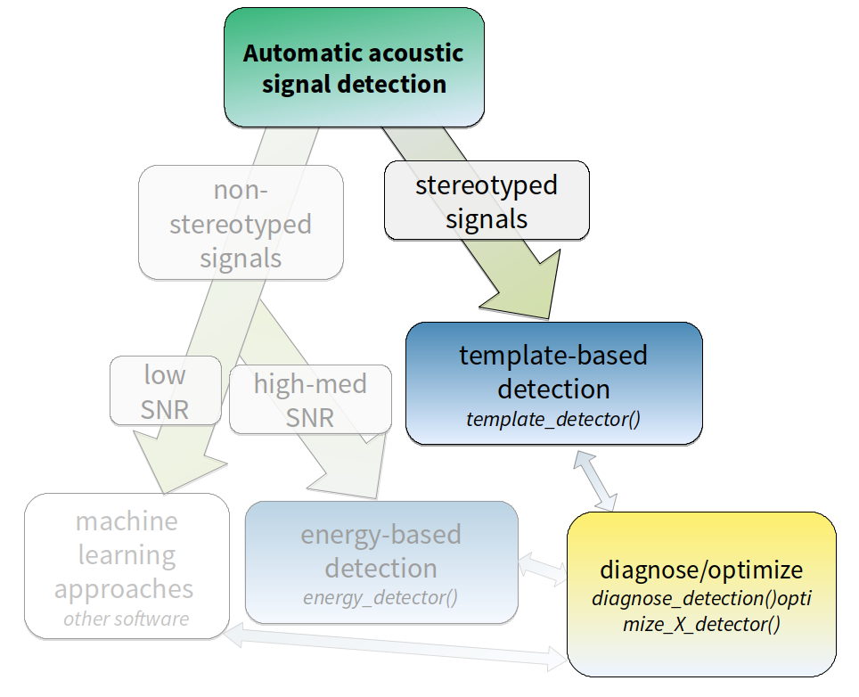
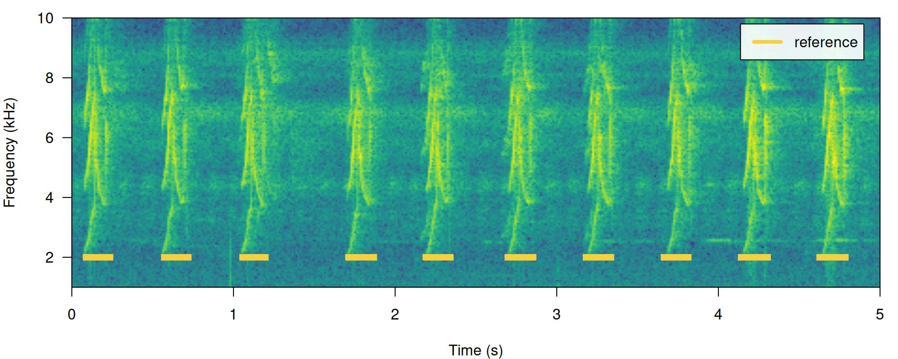
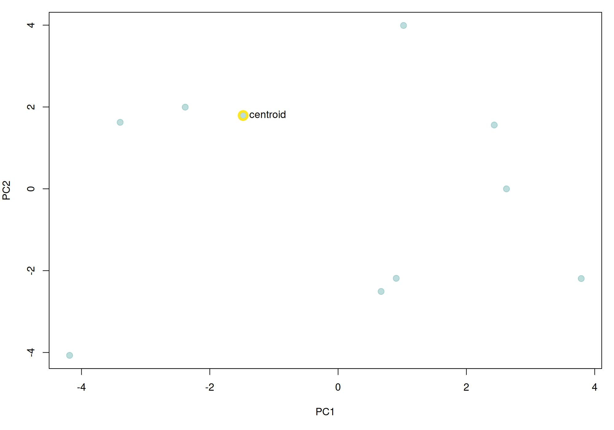
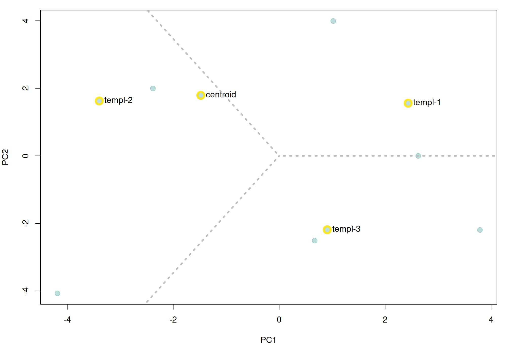
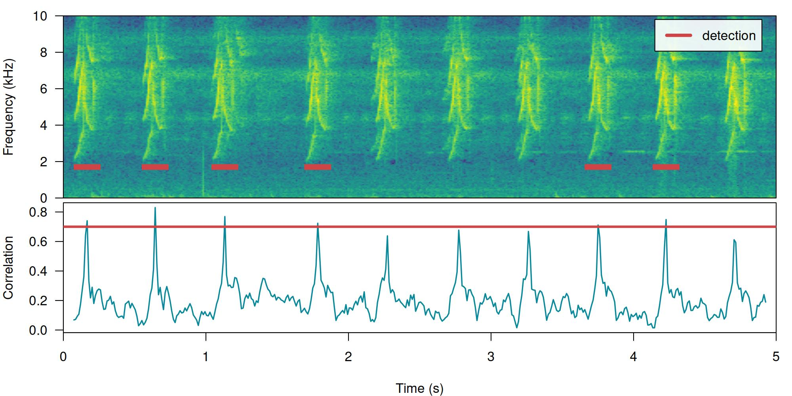

# Template-based detection

This vignette details the use of template-based detection in
[ohun](https://github.com/ropensci/ohun).Template-based detection method
is better suited for highly stereotyped sound events. As it is less
affected by signal-to-noise ratio it’s more robust to higher levels of
background noise:



*Diagram depicting how target sound event features can be used to tell
the most adequate sound event detection approach. Steps in which ‘ohun’
can be helpful are shown in color. (SNR = signal-to-noise ratio)*

The procedure for template-based detection is divided in three steps:

- Choosing the right template
  ([`get_templates()`](https://docs.ropensci.org/ohun/reference/get_templates.md))
- Estimating the cross-correlation scores of templates along sound files
  ([`template_correlator()`](https://docs.ropensci.org/ohun/reference/template_correlator.md))  
- Detecting sound events by applying a correlation threshold
  ([`template_detector()`](https://docs.ropensci.org/ohun/reference/template_detector.md))

First, we need to install the package. It can be installed from CRAN as
follows:

``` r

# From CRAN would be
install.packages("ohun")

#load package
library(ohun)
```

To install the latest developmental version from
[github](https://github.com/) you will need the R package
[remotes](https://cran.r-project.org/package=devtools):

``` r

# install package
remotes::install_github("maRce10/ohun")

#load packages
library(ohun)
library(tuneR)
library(warbleR)
```

The package comes with an example reference table containing annotations
of long-billed hermit hummingbird songs from two sound files (also
supplied as example data: ‘lbh1’ and ‘lbh2’), which will be used in this
vignette. The example data can be load and explored as follows:

``` r

# load example data
data("lbh1", "lbh2", "lbh_reference")

# save sound files
tuneR::writeWave(lbh1, file.path(tempdir(), "lbh1.wav"))
tuneR::writeWave(lbh2, file.path(tempdir(), "lbh2.wav"))

# select a subset of the data
lbh1_reference <-
  lbh_reference[lbh_reference$sound.files == "lbh1.wav",]

# print data
lbh1_reference
```

    
[30mObject of class 
[1m'selection_table'
[22m
[39m

    
[90m* The output of the following call:
[39m

    
[90m
[3m`[.selection_table`(X = lbh_reference, i = lbh_reference$sound.files == 
[23m
[39m
[90m
[3m"lbh1.wav")
[23m
[39m

    
[90m
[1m
    Contains:
[22m 
    *  A selection table data frame with 10 rows and 6 columns:
[39m

    
[90m     sound.files    selec    start      end   bottom.freq   top.freq
[39m

    
[90m---  ------------  ------  -------  -------  ------------  ---------
[39m

    
[90m10   lbh1.wav          10   0.0881   0.2360        1.9824     8.4861
[39m

    
[90m11   lbh1.wav          11   0.5723   0.7202        2.0520     9.5295
[39m

    
[90m12   lbh1.wav          12   1.0564   1.1973        2.0868     8.4861
[39m

    
[90m13   lbh1.wav          13   1.7113   1.8680        1.9824     8.5905
[39m

    
[90m14   lbh1.wav          14   2.1902   2.3417        2.0520     8.5209
[39m

    
[90m15   lbh1.wav          15   2.6971   2.8538        1.9824     9.2513
[39m

    
[90m... and 4 more row(s)
[39m

    
[90m
    * A data frame (check.results) with 10 rows generated by check_sels() (as an attribute)
[39m

    
[90mcreated by warbleR < 1.1.21
[39m

We can also plot the annotations on top of the spectrograms to further
explore the data (this function only plots one wave object at the time,
not really useful for long files):

``` r

# print spectrogram
label_spectro(wave = lbh1, reference = lbh1_reference, hop.size = 10, ovlp = 50, flim = c(1, 10))
```



------------------------------------------------------------------------

The function
[`get_templates()`](https://docs.ropensci.org/ohun/reference/get_templates.md)
can help you find a template closer to the average acoustic structure of
the sound events in a reference table. This is done by finding the sound
events closer to the centroid of the acoustic space. When the acoustic
space is not supplied (‘acoustic.space’ argument) the function estimates
it by measuring several acoustic parameters using the function
[`spectro_analysis()`](https://marce10.github.io/warbleR/reference/spectro_analysis.html)
from [`warbleR`](https://CRAN.R-project.org/package=warbleR)) and
summarizing it with Principal Component Analysis (after z-transforming
parameters). If only 1 template is required the function returns the
sound event closest to the acoustic space centroid. The rationale here
is that a sound event closest to the average sound event structure is
more likely to share structural features with most sounds across the
acoustic space than a sound event in the periphery of the space. These
‘mean structure’ templates can be obtained as follows:

``` r

# get mean structure template
template <-
  get_templates(reference = lbh1_reference, path = tempdir())
```

    
[30mcomputing spectral features (step 0 of 0):
[39m

    
[90mThe first 2 principal components explained 0.52 of the variance
[39m



The graph above shows the overall acoustic spaces, in which the sound
closest to the space centroid is highlighted. The highlighted sound is
selected as the template and can be used to detect similar sound events.
The function
[`get_templates()`](https://docs.ropensci.org/ohun/reference/get_templates.md)
can also select several templates. This can be helpful when working with
sounds that are just moderately stereotyped. This is done by dividing
the acoustic space into sub-spaces defined as equal-size slices of a
circle centered at the centroid of the acoustic space:

``` r

# get 3 templates
get_templates(reference = lbh1_reference, 
                          n.sub.spaces = 3, path = tempdir())
```

    
[90mThe first 2 principal components explained 0.52 of the variance
[39m



We will use the single template object (‘template’) to run a detection
on the example ‘lbh1’ data:

``` r

# get correlations
correlations <-
  template_correlator(templates = template,
                      files = "lbh1.wav",
                      path = tempdir())
```

The output is an object of class ‘template_correlations’, with its own
printing method:

``` r

# print
correlations
```

    
[30mObject of class 
[1m'template_correlations' 
    
[22m
[39m

    
[90m* The output of the following 
[3mtemplate_correlator()
[23m call: 
    
[39m

    
[90m
[3mtemplate_correlator(templates = template, files = "lbh1.wav", 
    
[23m
[39m
[90m
[3mpath = tempdir())
    
[23m
[39m

    
[90m* Contains 1 correlation score vector(s) from 1 template(s):
     
[3mlbh1.wav-10
[23m 
[39m

    
[90m
    ... and 1 sound files(s):
     
[3mlbh1.wav
[23m 
[39m

    
[90m
     * Created by 
[1mohun 
[22m1.0.4
[39m

This object can then be used to detect sound events using
[`template_detector()`](https://docs.ropensci.org/ohun/reference/template_detector.md):

``` r

# run detection
detection <-
  template_detector(template.correlations = correlations, threshold = 0.7)

detection
```

    
[30mObject of class 
[1m'selection_table'
[22m
[39m

    
[90m* The output of the following call:
[39m

    
[90m
[3mtemplate_detector(template.correlations = correlations, threshold = 0.7)
[23m
[39m

    
[90m
[1m
    Contains:
[22m 
    *  A selection table data frame with 6 rows and 6 columns:
[39m

    
[90msound.files    selec    start      end  template       scores
[39m

    
[90m------------  ------  -------  -------  ------------  -------
[39m

    
[90mlbh1.wav           1   0.0931   0.2410  lbh1.wav-10    0.7403
[39m

    
[90mlbh1.wav           2   0.5702   0.7180  lbh1.wav-10    0.8300
[39m

    
[90mlbh1.wav           3   1.0589   1.2067  lbh1.wav-10    0.7688
[39m

    
[90mlbh1.wav           4   1.7105   1.8583  lbh1.wav-10    0.7234
[39m

    
[90mlbh1.wav           5   3.6769   3.8248  lbh1.wav-10    0.7114
[39m

    
[90mlbh1.wav           6   4.1540   4.3019  lbh1.wav-10    0.7485
[39m

    
[90m
    * A data frame (check.results) with 6 rows generated by check_sels() (as an attribute)
[39m

    
[90mcreated by warbleR 1.1.37
[39m

The output can be explored by plotting the spectrogram along with the
detection and correlation scores:

``` r

# plot spectrogram
label_spectro(
  wave = lbh1,
  detection = detection,
  template.correlation = correlations[[1]],
  flim = c(0, 10),
  threshold = 0.7,
  hop.size = 10, ovlp = 50)
```



The performance can be evaluated using
[`diagnose_detection()`](https://docs.ropensci.org/ohun/reference/diagnose_detection.md):

``` r

#diagnose
diagnose_detection(reference = lbh1_reference, detection = detection)
```

      detections true.positives false.positives false.negatives splits merges   overlap
    1          6              6               0               4      0      0 0.9184415
      recall precision f.score
    1    0.6         1    0.75

## Optimizing template-based detection

The function
[`optimize_template_detector()`](https://docs.ropensci.org/ohun/reference/optimize_template_detector.md)
allows to evaluate the performance under different correlation
thresholds:

``` r

# run optimization
optimization <-
  optimize_template_detector(
    template.correlations = correlations,
    reference = lbh1_reference,
    threshold = seq(0.1, 0.5, 0.1)
  )
```

    5 thresholds will be evaluated:

``` r

# print output
optimization
```

      threshold   templates detections true.positives false.positives false.negatives splits
    1       0.1 lbh1.wav-10         89             10              79               0      0
    2       0.2 lbh1.wav-10         54             10              44               0      0
    3       0.3 lbh1.wav-10         17             10               7               0      0
    4       0.4 lbh1.wav-10         10             10               0               0      0
    5       0.5 lbh1.wav-10         10             10               0               0      0
      merges   overlap recall precision   f.score
    1      0 0.9241771      1 0.1123596 0.2020202
    2      0 0.9241771      1 0.1851852 0.3125000
    3      0 0.9241771      1 0.5882353 0.7407407
    4      0 0.9241771      1 1.0000000 1.0000000
    5      0 0.9241771      1 1.0000000 1.0000000

Additional threshold values can be evaluated without having to run it
all over again. We just need to supplied the output from the previous
run with the argument `previous.output` (the same trick can be done when
optimizing an energy-based detection):

``` r

# run optimization
optimize_template_detector(
  template.correlations = correlations,
  reference = lbh1_reference,
  threshold = c(0.6, 0.7),
  previous.output = optimization
)
```

    2 thresholds will be evaluated:

      threshold   templates detections true.positives false.positives false.negatives splits
    1       0.1 lbh1.wav-10         89             10              79               0      0
    2       0.2 lbh1.wav-10         54             10              44               0      0
    3       0.3 lbh1.wav-10         17             10               7               0      0
    4       0.4 lbh1.wav-10         10             10               0               0      0
    5       0.5 lbh1.wav-10         10             10               0               0      0
    6       0.6 lbh1.wav-10         10             10               0               0      0
    7       0.7 lbh1.wav-10          6              6               0               4      0
      merges   overlap recall precision   f.score
    1      0 0.9241771    1.0 0.1123596 0.2020202
    2      0 0.9241771    1.0 0.1851852 0.3125000
    3      0 0.9241771    1.0 0.5882353 0.7407407
    4      0 0.9241771    1.0 1.0000000 1.0000000
    5      0 0.9241771    1.0 1.0000000 1.0000000
    6      0 0.9241771    1.0 1.0000000 1.0000000
    7      0 0.9184415    0.6 1.0000000 0.7500000

In this case 2 threshold values (0.5 and 0.6) can achieve an optimal
detection.

## Detecting several templates

Several templates can be used within the same call. Here we correlate
two templates on the two example sound files, taking one template from
each sound file:

``` r

# get correlations
correlations <-
  template_correlator(
    templates = lbh1_reference[c(1, 10),],
    files = "lbh1.wav",
    path = tempdir()
  )

# run detection
detection <-
  template_detector(template.correlations = correlations, threshold = 0.6)
```

Note that in these cases we can get the same sound event detected
several times (duplicates), one by each template. We can check if that
is the case just by diagnosing the detection:

``` r

#diagnose
diagnose_detection(reference = lbh1_reference, detection = detection)
```

      detections true.positives false.positives false.negatives splits merges   overlap
    1         20             10              10               0      0      0 0.9306396
      recall precision   f.score
    1      1       0.5 0.6666667

In this we got perfect recall, but low precision. That is due to the
fact that the same reference events were picked up by both templates. We
can actually diagnose the detection by template to see this more
clearly:

``` r

#diagnose
diagnose_detection(reference = lbh1_reference, detection = detection, by = "template")
```

         template detections true.positives false.positives false.negatives splits merges
    1 lbh1.wav-10         10             10               0               0      0      0
    2 lbh1.wav-19         10             10               0               0      0      0
        overlap recall precision f.score
    1 0.9241771      1         1       1
    2 0.8789903      1         1       1

We see that independently each template achieved a good detection. We
can create a consensus detection by leaving only those with detections
with the highest correlation across templates. To do this we first need
to label each row in the detection using
[`label_detection()`](https://docs.ropensci.org/ohun/reference/label_detection.md)
and then remove duplicates using
[`consensus_detection()`](https://docs.ropensci.org/ohun/reference/consensus_detection.md):

``` r

# labeling detection
labeled <-
  label_detection(reference = lbh_reference, detection = detection, by = "template")
```

Now we can filter out duplicates and diagnose the detection again,
telling the function to select a single row per duplicate using the
correlation score as a criterium (`by = "scores"`, this column is part
of the
[`template_detector()`](https://docs.ropensci.org/ohun/reference/template_detector.md)
output):

``` r

# filter
consensus <- consensus_detection(detection = labeled, by = "scores")

# diagnose
diagnose_detection(reference = lbh1_reference, detection = consensus)
```

      detections true.positives false.positives false.negatives splits merges   overlap
    1         10             10               0               0      0      0 0.9046387
      recall precision f.score
    1      1         1       1

We successfully get rid of duplicates and detected every single target
sound event.

------------------------------------------------------------------------

Please cite [ohun](https://github.com/ropensci/ohun) like this:

Araya-Salas, M. (2021), *ohun: diagnosing and optimizing automated sound
event detection*. R package version 0.1.0.

## References

1.  Araya-Salas, M., Smith-Vidaurre, G., Chaverri, G., Brenes, J. C.,
    Chirino, F., Elizondo-Calvo, J., & Rico-Guevara, A. (2023). ohun: An
    R package for diagnosing and optimizing automatic sound event
    detection. Methods in Ecology and Evolution, 14, 2259–2271.
    <https://doi.org/10.1111/2041-210X.14170>
2.  Araya-Salas M, Smith-Vidaurre G (2017) warbleR: An R package to
    streamline analysis of animal sound events. Methods in Ecology and
    Evolution, 8:184-191.
3.  Khanna H., Gaunt S.L.L. & McCallum D.A. (1997). Digital
    spectrographic cross-correlation: tests of sensitivity. Bioacoustics
    7(3): 209-234.
4.  Knight, E.C., Hannah, K.C., Foley, G.J., Scott, C.D., Brigham, R.M.
    & Bayne, E. (2017). Recommendations for acoustic recognizer
    performance assessment with application to five common automated
    signal recognition programs. Avian Conservation and Ecology,
5.  Macmillan, N. A., & Creelman, C.D. (2004). Detection theory: A
    user’s guide. Psychology press.

------------------------------------------------------------------------

Session information

    R version 4.6.0 (2026-04-24)
    Platform: x86_64-pc-linux-gnu
    Running under: Ubuntu 24.04.4 LTS

    Matrix products: default
    BLAS:   /usr/lib/x86_64-linux-gnu/openblas-pthread/libblas.so.3 
    LAPACK: /usr/lib/x86_64-linux-gnu/openblas-pthread/libopenblasp-r0.3.26.so;  LAPACK version 3.12.0

    locale:
     [1] LC_CTYPE=en_US.UTF-8       LC_NUMERIC=C               LC_TIME=en_US.UTF-8       
     [4] LC_COLLATE=en_US.UTF-8     LC_MONETARY=en_US.UTF-8    LC_MESSAGES=en_US.UTF-8   
     [7] LC_PAPER=en_US.UTF-8       LC_NAME=C                  LC_ADDRESS=C              
    [10] LC_TELEPHONE=C             LC_MEASUREMENT=en_US.UTF-8 LC_IDENTIFICATION=C       

    time zone: Etc/UTC
    tzcode source: system (glibc)

    attached base packages:
    [1] stats     graphics  grDevices utils     datasets  methods   base     

    other attached packages:
    [1] warbleR_1.1.37     NatureSounds_1.0.5 knitr_1.51         seewave_2.2.4     
    [5] tuneR_1.4.7        ohun_1.0.4        

    loaded via a namespace (and not attached):
     [1] gtable_0.3.6       rjson_0.2.23       xfun_0.60          bslib_0.12.0      
     [5] ggplot2_4.0.3      vctrs_0.7.3        tools_4.6.0        bitops_1.1-0      
     [9] curl_8.0.0         parallel_4.6.0     proxy_0.4-29       pkgconfig_2.0.3   
    [13] KernSmooth_2.23-26 checkmate_2.3.4    RColorBrewer_1.1-3 S7_0.2.2          
    [17] desc_1.4.3         lifecycle_1.0.5    compiler_4.6.0     farver_2.1.2      
    [21] textshaping_1.0.5  brio_1.1.5         htmltools_0.5.9    class_7.3-23      
    [25] sass_0.4.10        RCurl_1.98-1.20    yaml_2.3.12        pkgdown_2.2.1     
    [29] jquerylib_0.1.4    MASS_7.3-65        classInt_0.4-11    cachem_1.1.0      
    [33] viridis_0.6.5      digest_0.6.39      sf_1.1-2           fastmap_1.2.0     
    [37] grid_4.6.0         cli_3.6.6          magrittr_2.0.5     e1071_1.7-17      
    [41] scales_1.4.0       backports_1.5.1    rmarkdown_2.31     httr_1.4.8        
    [45] signal_1.8-1       igraph_2.3.3       otel_0.2.0         gridExtra_2.3.1   
    [49] ragg_1.5.2         pbapply_1.7-4      evaluate_1.0.5     dtw_1.23-3        
    [53] fftw_1.0-9         testthat_3.3.2     viridisLite_0.4.3  rlang_1.3.0       
    [57] Rcpp_1.1.2         glue_1.8.1         DBI_1.3.0          jsonlite_2.0.0    
    [61] R6_2.6.1           systemfonts_1.3.2  fs_2.1.0           units_1.0-1       
